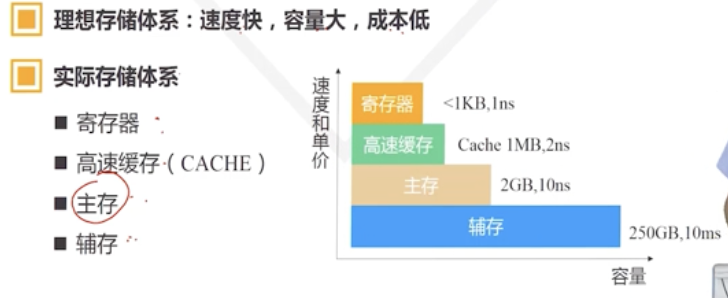

# 第一章：操作系统概述

## 初步认识操作系统

- 操作系统的功能一：进程管理
- 操作系统的功能二：内存管理
- 操作系统的功能三：设备管理
- 操作系统的功能四：文件管理

## 操作系统发展历史

- 操作系统发展的四个典型阶段
  - 手工操作，没有操作系统
  - 单通道批处理系统
  - 多通道批处理系统：多道处理，宏观并行，微观串行。

## 典型操作系统类型

- 微机操作系统
  - BIOS
  - MSDOS
  - Windows
- 实时操作系统
- 嵌入式操作系统
  - Androids
  - Linux
  - usOS
  - ucLinux
  - vxWorks
  - WinCE
- 网络操作系统
- 适合学习的小型的开源操作系统：
  - [MinixOS](www.minix3.org)
  - [linux](www.kernel.org)
  
# 操作系统逻辑

## 操作系统逻辑结构

- 层次结构：一个例子是TCP/IP协议栈
  - 分层结构的操作系统：所有功能模块按照调用的顺序排成若干层，相邻的层次之间只有单向的依赖/调用
- 微内核结构
  - 操作系统=微内核+核外服务器
  - 微内核：
    - 足够小，提供核心功能
    - 实现与硬件紧密相关的处理
    - 实现一些较基本的功能
    - 实现客户与服务器的通信
  - 核外服务器：
    - 完成OS的绝大部分服务功能，等待应用提出请求
    - 由若干服务器/进程构成

## CPU的态

- 态的分类
  - 核态
    - 能够访问所有资源、执行所有指令
    - 管理OS内核
  - 用户态
    - 访问部分资源
    - 用户程序
  - 管态（supervisor mode）：介于前两者之间
- IntelCPU的态：Ring0-Ring3
  - 程序段互相访问时会检查权限。
- 存储体系：
- CPU读取指令或数据时的访问：

  ```mermaid
  flowchart LR
  CPU <--> |命中|高速缓存<.-主存<-->辅存
  CPU <--> |没有命中|主存
  辅存-->|缺页|主存
  ```
  
## 中断机制

- 定义：中断是CPU对突发的外部事件的反应过程或者机制
- CPU受到外部信号后，停止当前工作，转去处理该外部事件，处理完毕后回到原来工作的中断处，继续原来的工作。
- 引入中断的目的：
  1. 实现并发活动
  2. 实现实时处理
  3. 故障自动处理
- 中断的一些概念
  - 中断源和中断类型
    - 引起系统中断的事件为中断源
  - 中断类型：
    - 程序没有预期的中断：强迫中断
    - 程序有预期：自愿中断
    - 由CPU外部事件引起：外中断
      - 中断原因紧要，CPU必须响应：不可屏蔽中断
      - 中断原因不很紧要，CPU可以不响应：可屏蔽中断
    - 由CPU内部事件引起：内中断
- 有关中断的一些概念：
  - 断点：程序中断的地方，即将执行下一条指令的地址
  - 现场：程序正确运行以来的信息集
  - 现场的两个处理：
    - 现场的保护：进入中断服务程序前：栈
    - 现场的恢复：退出中断服务程序后：栈
- 中断响应过程：
  1. 识别中断源
  2. 保护断点和现场
  3. 装入中断服务程序的入口地址
  4. 进入中断服务程序
  5. 恢复现场和断点
  6. 中断返回：IRET
- 中断响应的实质：
  - 交换指令执行地址
  - 交换CPU的态
